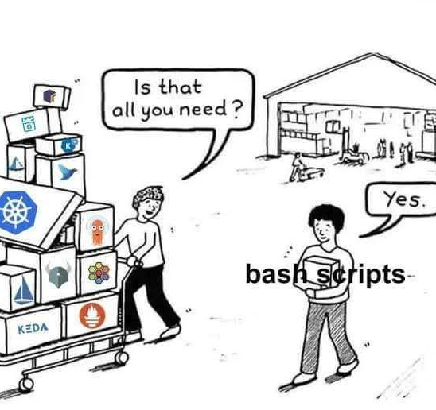
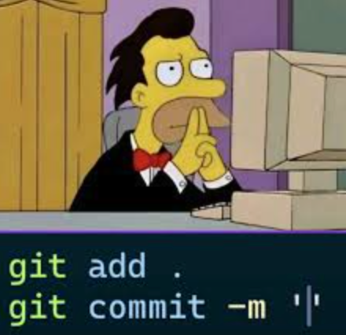
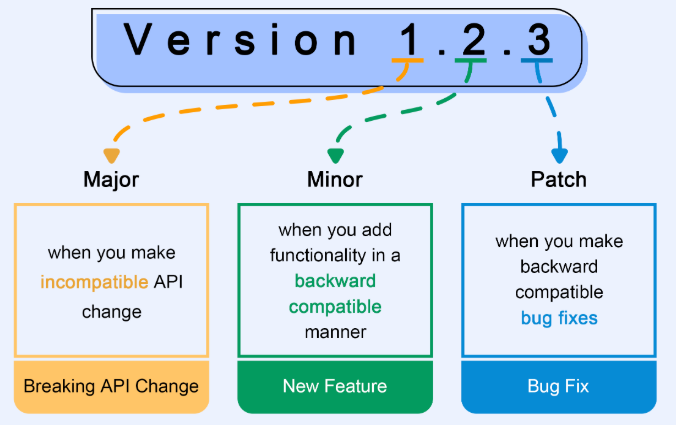

# Pipeline Proposal

> A proposal for a pipeline to be used.


**The pipeline should:**

- 🔧 Validate the codebase
- 🔨 Lint the codebase
- 🧪 Test the codebase
- 📦️ Create a new release

---

## Get familiar with the project structure

The project is organized into the following directories:

- `src/`: Source code for the calculator
- `tests/`: Unit tests for the calculator
- `operation.json`: Configuration file for the calculator
- `Makefile`: Makefile for the project

**Github Repository:** <https://github.com/acactown/simple-pipeline-poc>

---

## Tasks to complete

- [ ] **DMPINV-101:** Fix the *multiplication* operation issue
- [ ] **DMPINV-102:** Update the `README.md` file to include the *multiplication* operation
- [ ] **DMPINV-202:** Add tests for the *division* operation
- [ ] **DMPINV-303:** Add a new *subtraction* operation to the calculator

---

## EditorConfig - Code Style

> A tool to help maintain consistent coding styles between different editors and IDEs.


The EditorConfig project consists of a file format for defining coding styles and a collection of text editor plugins that enable editors to read the file format and adhere to defined styles. EditorConfig files are easily readable and they work nicely with version control systems.

The EditorConfig file is a simple text file that defines the coding styles for a project. It is used to maintain consistency across different editors and IDEs.

## EditorConfigChecker - Code Style Checker

> A tool to help maintain consistent coding styles between different editors and IDEs.


---

## ShellCheck - Shell Script Linting

> A static analysis tool for shell scripts that helps catch common errors and improve script quality.



ShellCheck is a GPLv3 tool that gives warnings and suggestions for bash/sh shell scripts. It can help you find:

- Syntax errors that can cause a shell script to fail
- Semantic problems that may cause a shell to behave strangely or incorrectly
- Subtle caveats, corner cases, and pitfalls that may cause an advanced user's otherwise working script to fail under future circumstances

---

## Conventional Commits

> The specification for adding human and machine readable meaning to commit messages.



The Conventional Commits specification is a lightweight convention on top of commit messages. It provides an easy set of rules for creating an explicit commit history; which makes it easier to write automated tools on top of. This convention describes the **features**, **fixes**, and **breaking changes** made in commit messages.

The **commit message** should be structured as follows:

```text
<type>: [optional task-id] <description>

[optional body]

[optional footer(s)]
```

The commit contains the following structural elements, to communicate intent:

1. **fix:** a commit of the type `fix:` patches a bug in your codebase.
2. **feat:** a commit of the type `feat:` introduces a new feature to the codebase.
3. **BREAKING CHANGE:** a commit that has a footer `BREAKING CHANGE`:, or appends a `!` after the type/scope, introduces a breaking API. A BREAKING CHANGE can be part of commits of any type.
4. **types other than fix & feat:**

- `chore:` routine tasks that are not specific to a feature or a bug, such as adding content to the `.gitignore` file or installing a dependency.
- `test:` when we add or fix tests.
- `docs:` when only documentation is modified.
- `build:` when the change affects the project's build/compilation.
- `ci:` the change affects configuration files and scripts related to continuous integration.
- `style:` readability or code formatting changes that do not affect functionality.
- `refactor:` code change that neither fixes bugs nor adds functionality, but improves the code.
- `perf:` used for performance improvements.
- `revert:` if the commit reverts a previous commit. The hash of the commit being reverted should be indicated.

## Commitlint - Commit Message Linter

> A tool to help enforce Conventional Commits.


It provides an easy set of rules for creating an explicit commit history; which makes it easier to write automated tools on top of. This convention describes the **features**, **fixes**, and **breaking changes** made in commit messages.

It checks the commit message against the Conventional Commits specification.

## Husky - Git Hooks

> A tool to help enforce Conventional Commits.

It is used to check the commit message against the Conventional Commits specification before it is committed.

---

## SemVer - Semantic Versioning

> Simple set of rules and requirements that dictate how version numbers are assigned and incremented.



Given a version number `MAJOR.MINOR.PATCH`, increment the:

- `MAJOR` version when you make incompatible API changes
- `MINOR` version when you add functionality in a backward compatible manner
- `PATCH` version when you make backward compatible bug fixes

**For example:**

- `1.0.0` -> compatible new feature -> `1.1.0` -> compatible new bug fix -> `1.1.1`
- `1.1.1` -> compatible new bug fix -> `1.1.2` -> compatible new bug fix -> `1.1.3`
- `1.1.3` -> breaking change -> `2.0.0`
- `2.0.0` -> compatible new bug fix -> `2.0.1` -> compatible new bug fix -> `2.0.2`

---

## GitHub Actions CI Pipeline

> Automated continuous integration using GitHub Actions and Super-Linter.

The project includes a comprehensive CI pipeline that runs automatically on pull requests to the main branch. The workflow is defined in `.github/workflows/ci.yml` and consists of three jobs:

### 1. Super-Linter Job

Runs the [super-linter](https://github.com/super-linter/super-linter) GitHub Action to validate code quality. This job checks:

- **EditorConfig**: Validates code formatting against `.editorconfig` rules
- **ShellCheck**: Analyzes shell scripts for errors and best practices using `.shellcheckrc`
- **Markdownlint**: Checks Markdown files for style consistency using `.markdown-lint.yml`

Configuration:

- Uses `.editorconfig-checker.json` for EditorConfig validation
- Uses `.shellcheckrc` for ShellCheck configuration
- Uses `.markdown-lint.yml` for Markdown linting rules
- Excludes `node_modules/`, `package-lock.json`, and `docs/` from validation

### 2. Commitlint Job

Validates commit messages in the pull request to ensure they follow the Conventional Commits specification:

- Checks all commits from the base branch to the head of the PR
- Uses `.commitlintrc.json` configuration
- Ensures commit messages follow the format: `<type>: [optional task-id] <description>`

### 3. Test Job

Runs the project's test suite after successful linting:

- Depends on both `super-linter` and `commitlint` jobs passing
- Sets executable permissions using `make permissions`
- Runs all unit tests using `make test`

### Running the Pipeline

The CI pipeline runs automatically when:

- A pull request is opened targeting the `main` branch
- New commits are pushed to an open pull request

---

## Release Please - Automated Releases

> Automate releases based on Conventional Commits specification.

Release Please automates the entire release process including version bumping, changelog generation, and creating GitHub releases. The workflow is defined in `.github/workflows/release.yml`.

### How It Works

1. **Commit Analysis**: Release Please analyzes commits since the last release using Conventional Commits format
2. **Release PR Creation**: Automatically creates and maintains a release PR with:
   - Updated version numbers in `package.json`
   - Generated/updated `CHANGELOG.md` with all changes
   - Proper SemVer version bumping based on commit types
3. **GitHub Release**: When the release PR is merged, automatically:
   - Creates a GitHub release with release notes
   - Tags the release with the new version
   - Runs post-release tests

---

## Markdownlint - Markdown Linting

> A tool to help maintain consistent Markdown formatting.


It is used to check the Markdown files against the Markdownlint specification.

---
